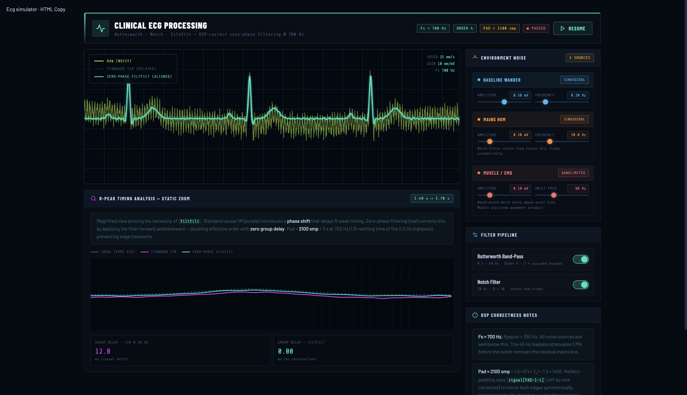

<div align="center">

# 🫀 ECG DSP Simulator

**An interactive, browser-based tool for teaching digital signal processing through real-time ECG filtering.**

No install. No dependencies. Open an HTML file and teach.

---

[](https://sjelodari.github.io/ECG-Simulator/)
[](https://sjelodari.github.io/ECG-Simulator/ECG-Simulator-Dark.html)
[](https://sjelodari.github.io/ECG-Simulator/ECG_Simulator_Light.html)

---

| Dark Theme | Light Theme |
|---|---|
|  |  |

</div>

---

## ⚡ Quick Start

Clone the repo and open either file directly in your browser:

| File | Theme |
|------|-------|
| `ecg_simulator_dark.html` | Monitor-style · dark background |
| `ecg_simulator_light.html` | ECG paper-style · warm white |

---

## 🎛 What It Does

Synthesises a realistic ECG at **700 Hz** and lets you inject three noise sources in real time, then compare two filtering strategies side by side:

```
Noise in  →  [ Butterworth 0.5–40 Hz ]  →  [ Notch 50/60 Hz ]
                       ↓                            ↓
              Standard IIR (delayed)     Zero-phase filtfilt (aligned)
```

**Each noise source has independent amplitude + frequency sliders:**

| Source | Model | Range |
|--------|-------|-------|
| 🌊 Baseline Wander | Sinusoidal | 0.05 – 1.0 Hz |
| ⚡ Mains Hum | Sinusoidal | 45 – 65 Hz |
| 💪 Muscle / EMG | Bandlimited noise | 20 – 200 Hz onset |

> The notch filter automatically tracks the mains hum frequency slider.

---

## 🔬 The Key Lesson

The **R-Peak Timing Analysis** zoom panel makes the phase-delay problem tangible:

```
Pure ECG     ───────────▲───────────
Standard IIR ──────────────▲───────   ← delayed by ~X ms
Zero-phase   ───────────▲───────────  ← perfectly aligned
```

A live **group delay readout** (in ms) shows students exactly how much the causal IIR shifts the QRS complex — and why `filtfilt` is used in offline analysis.

---

## 🧮 DSP Highlights

- **4th-order Butterworth** via 2 × cascaded biquads (Q = 0.5412 and 1.3065 — exact pole factors)
- **filtfilt** with `PAD = 2100 samples` — correctly sized for the 0.5 Hz highpass settling time at 700 Hz
- **Reflect-padding** with off-by-one fix (`signal[PAD−1−i]`, not `signal[PAD−i]`)
- **Direct Form II Transposed** biquads throughout

---

## 📚 Suggested for

> Biomedical Engineering · Clinical Instrumentation · DSP Fundamentals · Signal Processing Labs

---

## 📄 License

MIT — free to use, adapt, and share in any educational context.

---

<div align="center">
<sub>Built to make DSP tangible. The best way to understand a filter is to break a signal and watch it get fixed.</sub>
</div>
